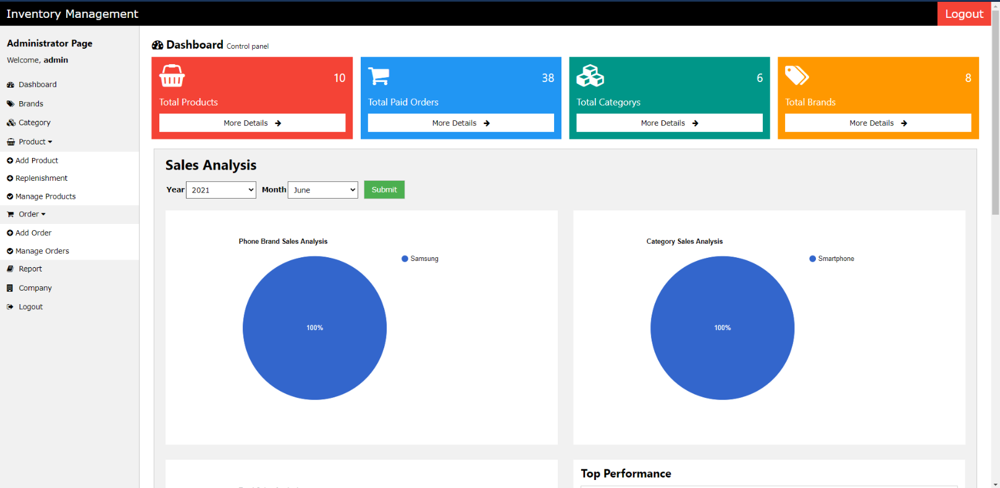

# Inventory-Management-System

An inventory management system designed to help users efficiently manage products, track stock levels, and analyze data through interactive charts and tables.

## 🔧 Technologies Used
- C#
- ASP.NET
- JavaScript
- XML
- SQL
- HTML & CSS
- DataTables.net
- Google Charts

## 📋 Features
- User authentication and role management
- Product and inventory tracking
- Stock monitoring and reporting
- Interactive tables and charts for data visualization

## Screenshots

-  Navigation Bar & Dashboard
-  
